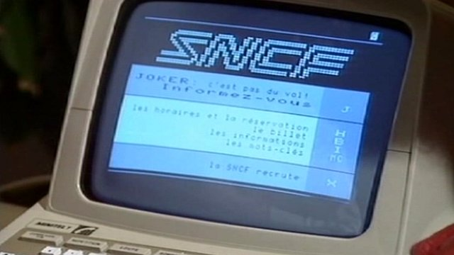

# Contexte et environnement

## Un peu d'histoire

### Les débuts du groupe

C'est par la convention du **31 août 1937** entre l'état et les acteurs ci-après qu'est établi l'unification du réseau ferré français. 

- [Compagnie du chemin de fer du Nord][1]
- [Compagnie du chemin de fer de l'Est][2]
- [Compagnie du chemin de fer de Paris à Orléans][3] *(PO)*
- [Compagnie du chemin de fer du Midi][4]
- [Compagnie du chemin de fer de Paris à Lyon et à la Méditerranée][5] *(PLM)*  

Les deux Syndicats du chemin de fer de la [Grande Ceinture][6] et de la [Petite Ceinture][7].  
Et les des deux administrations nationales, [les chemins de fer d'Alsace Lorraine](https://fr.wikipedia.org/wiki/Administration_des_chemins_de_fer_d%27Alsace_et_de_Lorraine), [Réseau de l'état](https://fr.wikipedia.org/wiki/Administration_des_chemins_de_fer_de_l%27%C3%89tat).

Celle-ci prévoit pour une durée de **45 ans** que l'état possède 51% du capital, les 49% restants étant pour les actionnaires des sociétés financières succédant aux anciennes companies.

Cette unification prend effet le **1er janvier 1938** pour former la nouvelle **SNCF**, celle-ci exploite alors un réseau de **42,500km** de voies dont **8%** électrifiées, le tout géré par **515,000** cheminots.

### Transformation en EPIC

C'est le 1er janvier 1983, à terme de la convention, que l'ensemble des actifs revient à l'état qui décide de faire de la SNCF un *Établissement Public à caractère Industriel et Commercial*.  
Le TGV est alors commercialisé depuis plus d'un an.  
La marque TER est créée en 1987.  

### Séparation et création de RFF

En 1990, la [directive européenne 91/440](https://fr.wikipedia.org/wiki/Directive_relative_au_d%C3%A9veloppement_de_chemins_de_fer_communautaires) vise à permettre une ouverture à la concurrence. Celle-ci impose la séparation de la gestion de l'infrastructure et de l'exploitations des services de transport.
C'est le **13 février 1997** qu'en réponse à cette directive, un nouvelle EPIC est créé, Réseau Ferré de France *(RFF)* par scission de la SNCF. RFF est désormais le propriétaire de l'infrastructure et décide désormais de l'aménagement, du développement et de la valorisation du réseau.  

Le rapport de la Cour des comptes de 2007 relève que la séparation entre gestion de l'infrastructure et de l'exploitation telle qu'elle a été effectuée en 1997 allait « au-delà des exigences » de l'article 1 de [la directive 91-440](https://fr.wikipedia.org/wiki/Directive_relative_au_d%C3%A9veloppement_de_chemins_de_fer_communautaires), qui n'exigeait qu'une séparation comptable.

### Réunification et création des trois EPIC

Suite à de nombreux de problèmes liées à la séparation des deux entités, le Sénat et l'Assemblée nationale constitue une nouvelle réforme en SNCF. Celle-ci prévoit la réunification de la SNCF et RFF. Elle prévoit aussi une réorganisation de la SNCF en trois EPIC:

- **SNCF**, l'EPIC de tête, la gouvernance du groupe.
- **SNCF Réseau**, gestionnaire de l'infrastructure.
- **SNCF Mobilité**, chargé de l'exploitation.

### La SNCF aujourd'hui

En 2016, les trois EPIC emploient **146,623 salariés** et compte **260,000 collaborateurs**. Avec un chiffre d'affaires de **31,4 Md€** donc **33%** réalisés à l'international, le groupe transporte **13,5 millions** de voyageurs chaque jour, il est présent dans **120** pays.

En 2017 **Keolis**, filiale privé de SNCF Mobilités, opérateur de transport public, est le leader mondial du metro automatique et du tramway, avec **61,070 salariées** répartis dans dix-sept pays à travers le monde et un chiffre d'affaires de **5,399 Md€**.  
C'est lui qui exploite par exemple le réseau Divia.  

### L'ère du digital

L'arrivé et la croissance exponentielle de l'informatique et du digital confronte aujourd'hui le groupe à de nouvelles problématiques mais aussi de nouvelles opportunités.
Le groupe est acteur dans de nombreuses nouvelles innovations, pour n'en citer que quelques unes:

- [Investissements et exploitation](https://www.usine-digitale.fr/article/keolis-et-valeo-misent-sur-la-navette-autonome-navya-leve-30-millions-d-euros.N449887) conjointement avec Navya de deux navette 100% autonome à Lyon depuis 2016 et Los Angeles depuis cette année.
- 2017, [création d'ALTAMETRIS](https://www.sncf-reseau.fr/fr/actualite/institutionnel/lancement-de-la-filiale-drones-sncf-reseau-altametris), filiale de SNCF Réseau, traitements de données sur le réseau acquises par drones et robots.

Bien que l'informatique soit présente depuis le début au service des voyageurs:

Elle cherche encore sa place dans le reste des organisations qui constitue la SNCF, c'est le cas du pôle dont je fais partie.

## Ma situation dans l'entreprise

Pour pouvoir me situer dans cette grande entreprise, je vous propose de descendre la hiérarchie depuis le sommet:

### SNCF Mobilités

Comme rapporté précédemment, c'est l'un des trois grands EPIC qui compose la SNCF.
Cette entité est chargé de l'exploitation des trains de voyageurs et de marchandises en France.  
En 2015 elle emploie près des 2/3 des effectifs de la SNCF.

### SNCF Matériel

Cette entité à pour charge la maintenance du matériels roulants, ce qui représente près de 17,000 machines.  
Ce dispositif est répartit dans 4 entités distinctes:

- La direction du matériel
- Les entités d'ingénierie
- Les entités support (Technicampus et CLI)
- Les 38 technicentre (28 de maintenance et 10 industriels)

### Technicentre Bourgogne Franche Comté

Le **TBFC** se situe est répartit sur quatres sites:

- Le site de Perrigny, *le site principal ou je me situe*
- Le site de Dijon ville
- Le site de Gevrey
- Le site de Besançon

Le technicentre à pour rôle la maintenance du parc des locomotives et wagons TER et FRET de la région.  

Il est dirigé par *Sylvain Miguet*, et est plus ou moins répartit selon les services suivants:

- Appui Production
- STF BFC, *(Supervisions techniques de flotte)*
- GEF
- QSE
- RH *(Ressource humaines)*
- Amélioration continue
  - Installation et outillages
  - Cellule Digitale
- UO TER *(Unité Opérationelle)*
- UO LOC Wagon Station *(Unité Opérationelle)*

### Pole Amélioration Continue

Le pole amélioration continue à pour but, l'amélioration des processus du Technicentre.  

Celui-ci est sous la direction de *Lionel Ramos* mon tuteur actuel.

Il est donc divisé en deux pôles, installation et outillages, qui a pour mission l'amélioration de l'environement de travail par le biais de nouveaux outils ou infrastructure, et la Cellule digitale.

### Cellule Digitale

#### Création

Comme je le précisais plus tôt, l'informatique apporte de nouveaux défis mais aussi de nouvelles opportunitées:  
C'est dans ce cadre que s'inscrit la cellule digitale. Cette initiative est relativement nouvelle, en effet l'informatique de proximité est loin d'être la règle actuellement à la SNCF.

Depuis sa création, il y à un peu plus de quatres ans, elle à pour rôle le développement et la maintenance de nombreuses applications pour répondre au problèmatiques de l'amélioration continu des processus du technicentre.

> Demander précision Alan, Lionel, Sylvain

#### Composition

Durant mon alternance, la cellule digitale a été composé du personnel suivant:

- **Alan Morin**, Développeur titulaire
- **Kevin Dos Santos**, Alternant Développeur *(jusqu'en juillet 2018)*
- **Christophe Chuy**, Alternant Développeur *(jusqu'en novembre 2017)*
- Moi même  

#### Acteurs concernés

Le travail de la cellule peut aussi bien concerner les unitées de production que les autres fonctions supports, cela varie selon les projets.  

C'est dans ce contexte que j'ai pu travailler sur les projets que je présenterais dans la suite de ce rapport.

## Contexte technique

- Réseau  
  - Proxy
- Navigateur  
- Applications Web  
- Framework  
- Outils  
- Déploiement 
  - Lyon  

[1]: https://fr.wikipedia.org/wiki/Compagnie_des_chemins_de_fer_du_Nord
[2]: https://fr.wikipedia.org/wiki/Compagnie_des_chemins_de_fer_de_l%27Est
[3]: https://fr.wikipedia.org/wiki/Compagnie_du_chemin_de_fer_de_Paris_%C3%A0_Orl%C3%A9ans
[4]: https://fr.wikipedia.org/wiki/Compagnie_des_chemins_de_fer_du_Midi_et_du_Canal_lat%C3%A9ral_%C3%A0_la_Garonne
[5]: https://fr.wikipedia.org/wiki/Compagnie_des_chemins_de_fer_de_Paris_%C3%A0_Lyon_et_%C3%A0_la_M%C3%A9diterran%C3%A9e
[6]: https://fr.wikipedia.org/wiki/Ligne_de_la_grande_ceinture_de_Paris
[7]: https://fr.wikipedia.org/wiki/Ligne_de_Petite_Ceinture
