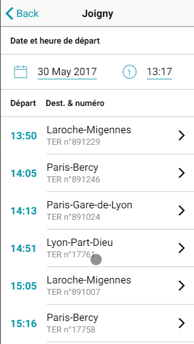

# Ouitalk

Ouitalk, initialement train-train, est ma première réel expérience de développement. J'ai travaillé seul et en autonomie sur le sujet ormis pour une refonte du design sur laquelle Kevin m'a aidé.

## Contexte

### Hackathon mobilité

Dans les faits, cette application ne s'inscrit pas dans le cadre métier du technicentre. Les problèmatiques dont elle traite ont été soulevé lors d'un hackathon au début de l'année 2017.  

C'était une initiative de mon tuteur de l'époque, Fabien Chanoit, et de mon chef d'établissement, Sylvain Miguet, que de développer un prototype dans le but d'explorer le champ des possibles et avec optique de le proposer pour la nouvelle convention TER BFC 2018.

### Convention TER

L'année 2017 était un contexte particulier pour la SNCF dans la région Bourgogne Franche Comté, celui de la signature d'une nouvelle convention TER.  

J'en ai omis les détails historiques dans la présentation de l'entreprise, mais l'organisation des TER et particulière. En réalité, il s'agit d'une convention au niveau régional entre la région et la SNCF qui définit le rôles et mission de chacun. La région est l'autorité organisatrice, elle définit l'offre qu'elle souhaite, dessertes, qualités de services, horaires, tarification, etc... La SNCF en assure alors la réalisation.

### TODO: retrouver le nom des programmes

doit être capable de fournir une meilleur traçabilité et satisfaction client.

### Problématique

Les problèmatiques de Ouitalk sont centrées sur un sujet, la communication, aussi bien entre voyageurs qu'avec l'exploitant. Le hackathon en lui même prévoyait beaucoup plus large mais travaillant seul, il a été choisie de réduire quelques peu.  

C'est donc dans l'optique d'avoir une meilleur visibilité de l'opinion client et de créer une atmosphère d'échange qu'a était développé Ouitalk.  

Voici le diagramme des cas d'utilisation, *simplifié*, de l'application mobile que j'ai développé.

  

Et celui du back office, qui, lui n'as pas été developpé car le projet fut suspendu avant.

  

Ci-dessous une capture d'écran de l'application vu par un client, il s'agit de la liste des trains au départ de la gare de joigny.  

<!-- TODO: parcour utilisateur -->