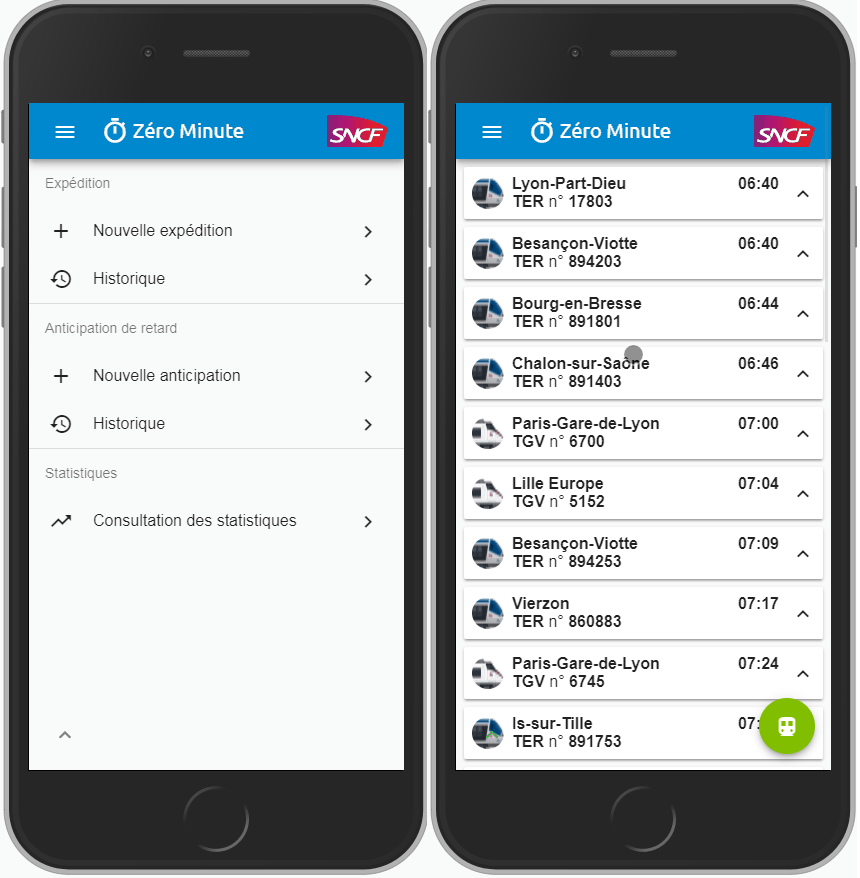

# Zéro Minute

Zéro minute est la seconde application sur laquelle j'ai travaillé. J'ai d'abord commencé seul durant le mois de décembre du fait du départ en congé de mes collègues qui m'ont ensuite rejoint en décembre.

L'application était déjà en place depuis presque deux ans quand j'ai eu pour mission d'y rajouter un nouveau module.

## Contexte

Cette application est née d'une demande de la gare de Dijon. Celle-ci voulait avoir une meilleur traçabilité sur les retards en  départs de la gare.

Pour répondre à cette problématique, les fonctionnalités suivantes ont donc étaient développées avant mon arriver sur le projet:

Les agents d'escales sont les agents en gare qui accompagne l'arrivé et le départ des trains.

Voici donc le parcours type d'un agent d'escale après qu'un train soit parties de la gare:

- Sélectionne le train dans la liste *(ou rempli les données manuellement s'il n'est pas présent dedans)*
- Déclare s'il est partit à l'heure ou en retard
- S'il est partit en retard, remplie la durée et les causes ainsi que l'entité responsable

Chaque déclaration est ensuite ajouter à la base de données permettant de générer des statistiques sur les causes de retard récurentes, le ratio retard / à l'heure, le retard moyen, etc...

